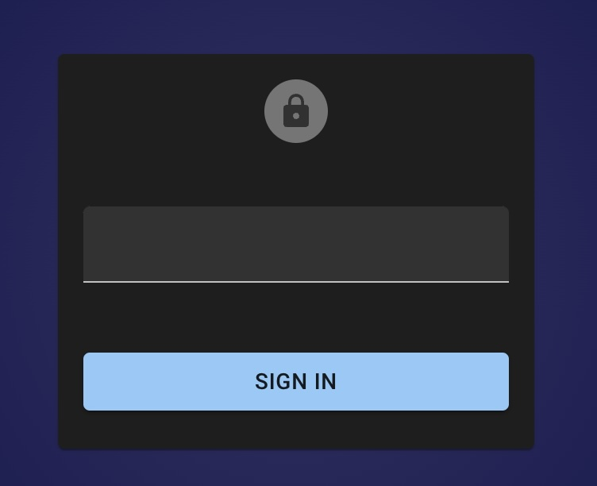

# Access Control Lists

Dkron provides an optional Access Control List (ACL) system which can be used to control access to data and APIs. The ACL is capability-based, relying on policies to determine which fine-grained rules can be applied. Dkron's capability-based ACL system is very similar to common ACL systems you are used to.

## ACL System Overview

Dkron's ACL system is implemented with the CNCF [Open Policy Agent](https://www.openpolicyagent.org/) bringing a powerful system to suit your needs.

The ACL system is designed to be easy to use and fast to enforce while providing administrative insight. At the highest level, there are two major components to the ACL system:

* **OPA policy engine.** OPA provides policy decision-making [decoupling](https://www.openpolicyagent.org/docs/latest/philosophy/#policy-decoupling). Dkron integrates OPA as a library and provides default policy rules written in the OPA Policy language. These rules enforce permissions on request parameters to the `/v1` API paths and are ready to use for most cases. You do not need to learn the OPA Policy language to start using Dkron's ACL system, but you can modify the default policy rules to adapt to your use case if needed. Read more in the [OPA docs](https://www.openpolicyagent.org/docs/latest/).

* **ACL Policies.** Dkron's ACL policies are simple JSON documents that define patterns to allow access to resources. You can find below an example ACL policy that works with the default OPA policy. The ACL JSON structure is not rigid; you can adapt it to add new features in combination with the OPA Policy rules.

## Tutorial

### Configuring ACLs

ACLs are not enabled by default and must be enabled. To enable ACLs, set up the `acl` section in your config file:

```yaml
acl:
  enabled: true
```

Below you can find the most basic example of an ACL policy:

Basic example policy:

```json
{
    "path": {
        "/v1": {
            "capabilities": [
                "read"
            ]
        },
        "/v1/**": {
            "capabilities": [
                "create",
                "read",
                "update",
                "delete",
                "list"
            ]
        }
    }
}
```

This policy allows requests to the `/v1` API paths. Paths use glob patterns, and capabilities allow operations on resources.

This is a much more granular policy file used as default policy:

```json
{
    "path": {
        "/v1/members": {
            "capabilities": ["read"]
        },
        "/v1/jobs": {
            "capabilities": [
                "list",
                "read",
                "create",
                "update",
                "delete"
            ]
        },
        "/v1/jobs/*": {
            "capabilities": [
                "create",
                "read",
                "update",
                "delete"
            ]
        },            
        "/v1/jobs/*/run": {
            "capabilities": ["create"]
        },
        "/v1/jobs/*/toggle": {
            "capabilities": ["create"]
        },
        "/v1/jobs/*/executions*": {
            "capabilities": ["read"]
        },
        "/v1/jobs/*/executions/*": {
            "capabilities": ["read"]
        },
        "/v1/leader": {
            "capabilities": ["read"]
        },
        "/v1/isleader": {
            "capabilities": ["read"]
        },
        "/v1/leave": {
            "capabilities": ["create"]
        },
        "/v1/restore": {
            "capabilities": ["create"]
        },
        "/v1/busy": {
            "capabilities": ["read"]
        }
    }
}
```

### Setup

The first step after enabling the ACL system and restarting the service is to bootstrap the management token.

:::note
The `dkron acl bootstrap` command currently expects the `policies/default.json` file to be present in the working directory. Ensure you run this command from the Dkron project root or a directory where the `policies/` folder is available.
:::

Run this command to create the initial management token:

```bash
dkron acl bootstrap
```

:::info
Adjust your `--rpc-addr` param if necessary.
:::

After this step you will obtain the details of the management token, something similar to:
```
Accessor ID: fc4a83e5-4657-4c18-92b0-723d7c5f6c1f
Secret: ca40c646-4a86-425d-ae55-b27fdd99d8c4
Name: bootstrap
Type: management
CreateTime: 2024-10-06 11:03:36.605368 +0000 UTC
Policies: default
```

From this point, you must use the "Secret" to communicate with the Dkron API. Management tokens can administer ACL policies, while client tokens are constrained by their assigned policies.

When making API requests, include the secret in the `Authorization` header:

```bash
curl -H "Authorization: Bearer <Secret>" http://localhost:8080/v1/jobs
```

If you navigate to your Dkron installation, it should show the login page:



Enter the secret and click on "Sign in", after that you should be able to use the UI without limitations.

Check the full documentation on all the available [ACL management commands](cli/dkron_acl).

### Use the readonly policy

```json
{
    "path": {
        "/v1/members": {
            "capabilities": ["read"]
        },
        "/v1/jobs": {
            "capabilities": [
                "list",
                "read"
            ]
        },
        "/v1/jobs/*": {
            "capabilities": [
                "read"
            ]
        },            
        "/v1/jobs/*/executions*": {
            "capabilities": ["read"]
        },
        "/v1/jobs/*/executions/*": {
            "capabilities": ["read"]
        },
        "/v1/leader": {
            "capabilities": ["read"]
        },
        "/v1/isleader": {
            "capabilities": ["read"]
        },
        "/v1/busy": {
            "capabilities": ["read"]
        }
    }
}
```

Save the JSON above to a local file named `readonly.json`. The policy document must have `path` at its top level; do not wrap it in a `rules` object.

Create or update the `readonly` policy from that file. The `--rules-file` flag belongs to `acl policy apply`:

```bash
dkron acl policy apply --name readonly --rules-file ./readonly.json
```


Then create a client token and associate the existing `readonly` policy with it. `acl token create` accepts `--policy`, but it does not accept `--rules-file`:

Clients using this token will be able to perform `GET` requests, but any write attempts will return a `403 Forbidden` error:

```bash
dkron acl token create --name alice --type client --policy readonly
```

Provide the token details to the user securely.

## Inspecting job contents in OPA policies

### Policy input

Dkron supplies the following fields to the OPA policy:

| Field | Contents |
| --- | --- |
| `input.method` | HTTP request method, such as `POST`. |
| `input.path` | Request URL path, without query parameters. |
| `input.token` | Authenticated bearer secret. Do not log this value. |
| `input.rules` | The JSON rules from the token's first associated ACL policy. |
| `input.body` | The decoded job on the job-write routes below; an empty object on other routes. |

Job contents are available on these routes:

- `POST /v1/jobs`
- `PATCH /v1/jobs`
- `PUT /v1/jobs/:job`

There is no `PUT /v1/jobs` route. The default OPA policy does not authorize PATCH. If you extend its method-to-capability mapping to permit PATCH, apply the same content restrictions as for POST and PUT.

`input.body` is the decoded job shared with the API handler, rather than the raw JSON document. It uses canonical job field names and includes defaults and zero values. The owner is the authenticated token's accessor, the ID is the job name, and concurrency defaults to `allow`. Unknown job fields are omitted. Sharing the decoded job ensures that authorization and job handling interpret repeated or differently capitalized JSON fields consistently. Normal job validation still runs after authorization.

With ACL enabled, job submissions must contain a single JSON object and are limited to **10 MiB**. Invalid bodies return **400 Bad Request**, oversized bodies return **413 Request Entity Too Large**, and policy denials return **403 Forbidden**.

Other routes retain `input.body == {}`. Their request streams are not parsed or consumed by the ACL middleware, including multipart restore uploads. Restrict access to `/v1/restore` separately if a token must not import arbitrary jobs.

### Adding content restrictions

For example, a policy can inspect both the executor and its command:

```rego
input.body.executor == "shell"
input.body.executor_config.command == "cronexec alice task"
```

These are conditions to use in a rule, not a complete policy. Apply them to job-write requests while retaining your existing method, path, capability, and token checks. Adding them unconditionally to a general rule would also deny reads and other routes whose body is empty.

:::warning Keep content checks in the authorization path
A separate `allow` rule provides an alternative way to authorize a request. Do not add a content-checking `allow` rule alongside an existing rule that already permits unrestricted job writes. Every rule that can authorize a job write must enforce the required restrictions.
:::

Keep user allow-lists in administrator-controlled ACL policy data, rather than in fields supplied with the job. For example, a custom ACL JSON policy can include an `allowed_users` array alongside `path`; your Rego policy can check a parsed wrapper user against `input.rules.allowed_users`. Associate different ACL policies with tokens that need different allow-lists.

When restricting commands to a wrapper such as `cronexec`, validate its argument grammar and execution settings as well as the command string. A prefix check alone is insufficient: enabling shell interpretation can allow additional commands after the wrapper invocation. Account for quoting, `executor_config.shell`, and environment settings that could change execution behavior.

## Debugging OPA policies

Policy `print()` statements are disabled by default. Enable them in the agent configuration:

```yaml
acl:
  enabled: true
  debug: true
```

Restart Dkron after changing the configuration. Policy print messages are emitted through Dkron's logger at **info** level with `component=acl-policy`, so the configured log level must permit info messages. Raising the log level alone does not enable print statements.

Print selected fields while evaluating a job-write rule, for example:

```rego
print("job executor", input.body.executor)
```

Dkron does not automatically dump policy input. Avoid `print(input)`: it includes the bearer secret, and job configuration may contain credentials. Disable `acl.debug` after troubleshooting.

You can also test Rego policies outside Dkron using the OPA CLI with synthetic input. Such tests validate policy logic but do not change which fields an older Dkron binary supplies.

## Disable ACLs

To disable the ACL system, set the configuration value in your Dkron configuration file to `false`:

```yaml
acl:
  enabled: false
```

Restart your system for the change to take effect. After the restart, you should be able to access the system without any restriction.
